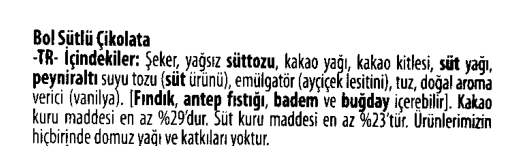
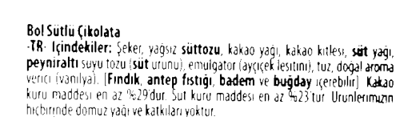

# Görüntü İşleme ve OCR Projesi

Bu proje, görüntü işleme ve Optik Karakter Tanıma (OCR) teknolojilerini kullanarak bir görseldeki metinleri tespit etmeyi amaçlamaktadır. Çeşitli görüntü işleme teknikleriyle görselin ön işleme adımları yapılmış, ardından EasyOCR kütüphanesi ile metin analizi gerçekleştirilmiştir.

## Proje Adımları

1. **Görüntü Yükleme ve Gösterme**  
   İlk olarak, bir görsel yüklenmiş ve `OpenCV` ve `Matplotlib` kullanılarak görselin orijinal hali ekranda gösterilmiştir.

2. **Siyah Beyaz Görüntü**  
   Görüntü, gri tonlamalı hale getirilmiş ve siyah beyaz hali `Matplotlib` ile gösterilmiştir.

3. **Ters Görüntü Alma**  
   Görüntü ters çevrilmiş (inverted) ve bu hali de ekranda görsel olarak gösterilmiştir.

4. **Binarizasyon**  
   Görüntü, `Thresholding` yöntemi ile siyah-beyaz hale getirilmiş, ardından bu görüntüdeki metinlerin tanımlanabilirliği artırılmıştır.

5. **Gürültü Giderme**  
   Gürültü azaltma adımında, çeşitli morfolojik işlemler (dilatasyon ve erozyon) ve median blur filtreleri kullanılarak görüntüdeki istenmeyen gürültüler temizlenmiştir.

6. **Font İnceltilmesi ve Kalınlaştırılması**  
   Görüntüdeki yazı tipi, erozyon ve dilatasyon işlemleri ile inceltilmiş ve kalınlaştırılmıştır.

7. **OCR ile Metin Tespiti**  
   EasyOCR kütüphanesi ile, işlenmiş görüntüler üzerinde metin tanıma yapılmış ve elde edilen metinler, güven oranlarıyla birlikte kullanıcıya sunulmuştur.

8. **Sonuçların Görselleştirilmesi**  
   OCR ile tespit edilen metinler, görsel üzerinde gösterilmiş ve her bir metnin güven oranı eklenmiştir.

9. **Ortalama Güven Değeri Hesaplama**  
   Her bir görüntü için OCR güven oranları hesaplanmış ve görsellerin ortalama güven oranları karşılaştırılmıştır.

10. **Grafiklerle Sonuçların Görselleştirilmesi**  
    Ortalama güven oranlarını karşılaştırmak için bar grafiği, pasta grafiği ve çizgi grafiği oluşturulmuştur.

## Kullanılan Kütüphaneler

- `OpenCV` (cv2) : Görüntü işleme için kullanıldı.
- `Matplotlib` : Görsellerin gösterilmesi için kullanıldı.
- `EasyOCR` : Görseldeki metinleri tanımak için kullanıldı.
- `NumPy` : Matris işlemleri ve görüntü işleme adımlarında kullanıldı.

## Proje Adımları Detaylı Açıklamalar

### Ters Görüntü Alma
```python
inverted_image = cv2.bitwise_not(img_gray)
plt.imshow(inverted_image, cmap='gray')
plt.axis('off')
plt.show()
```

### Binarizasyon
```python
thersh, im_bw = cv2.threshold(inverted_image, 80, 200, cv2.THRESH_BINARY)
plt.imshow(im_bw, cmap='gray')
plt.axis('off')
plt.show()
```


### Gürültü Giderme
```python
def noise_removal(image):
    kernel = np.ones((1, 1), np.uint8)
    image = cv2.dilate(image, kernel, iterations=1)
    kernel = np.ones((1,1), np.uint8)
    image = cv2.erode(image, kernel, iterations=1)
    image = cv2.morphologyEx(image, cv2.MORPH_CLOSE, kernel)
    image = cv2.medianBlur(image, 3)
    return image
no_noise = noise_removal(im_bw)
plt.imshow(no_noise, cmap='gray')
plt.axis('off')
plt.show()
```
### Font İnceltilmesi ve Kalınlaştırılması
```python
def thin_font(image):
    image = cv2.bitwise_not(image)
    kernel = np.ones((2, 2), np.uint8)
    image = cv2.erode(image, kernel, iterations=1)
    image = cv2.bitwise_not(image)
    return image
eroded_image = thin_font(no_noise)
plt.imshow(eroded_image, cmap='gray')
plt.axis('off')
plt.show()
```


### OCR ile Metin Tespiti
```python
import easyocr
reader = easyocr.Reader(['tr'])  # Türkçe metinler için
results1 = reader.readtext(dilate_image)
results2 = reader.readtext(eroded_image)
results3 = reader.readtext(im_bw)
```
### Ortalama Güven Oranları Hesaplama
```python
confidences1 = [confidence for (_, _, confidence) in results1]
confidences2 = [confidence for (_, _, confidence) in results2]
confidences3 = [confidence for (_, _, confidence) in results3]

avg_confidence1 = sum(confidences1) / len(confidences1) if confidences1 else 0
avg_confidence2 = sum(confidences2) / len(confidences2) if confidences2 else 0
avg_confidence3 = sum(confidences3) / len(confidences3) if confidences3 else 0
```
### Sonuçlar

- **Görüntü 1 Ortalama Güven**: %35.13
- **Görüntü 2 Ortalama Güven**: %35.23
- **Görüntü 3 Ortalama Güven**: %50.78

Grafiklerle görselleştirilmiş sonuçlar için aşağıdaki grafikler incelenebilir:

- **Bar Grafiği**
- **Pasta Grafiği**
- **Çizgi Grafiği**
  

